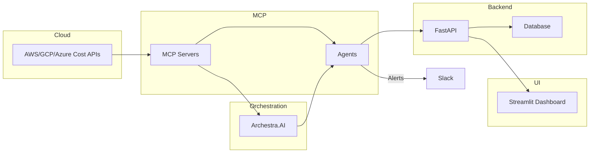

# CostGuard AI

Autonomous cloud resource and AI model cost optimization platform.

## Project Overview

CostGuard AI deploys MCP-based agents that continuously monitor cloud spending and LLM usage, identify optimization opportunities, and autonomously adjust resource allocation. Agents use Archestra.AI for orchestration and decision-making, with safety limits to prevent runaway spending.

## Problem Statement

Cloud and LLM usage costs are increasingly complex and opaque. Teams need automated tooling to detect anomalies, route LLM queries to cost-appropriate models, and scale resources efficiently.

## Solution Overview

CostGuard AI provides:
- Continuous cost monitoring across AWS, GCP, and Azure
- LLM usage tracking and intelligent model switching
- Automated optimization and resource scaling with human approval flows
- Dashboards for real-time visibility

## Key Features

- Cost monitoring & anomaly detection
- LLM request routing & model optimization
- Auto-scaling and rightsizing for cloud resources
- Approval workflows and Slack notifications
- Prometheus + Grafana monitoring

## Tech Stack

- Python 3.10+
- FastAPI
- Streamlit
- MCP (Model Context Protocol)
- Archestra.AI
- Docker / docker-compose
- Prometheus + Grafana

## Architecture



## Quick Start

1. Copy `.env.example` to `.env` and populate keys.
2. Create virtualenv and install dependencies:

```bash
python3 -m venv .venv
source .venv/bin/activate
pip install -e .
```

3. Start development services:

```bash
make docker-up
make dev
```

4. Open dashboard at `http://localhost:8501` and API at `http://localhost:8000`.

## Installation

See `Makefile` for common commands. Use `scripts/setup.sh` for automated setup on Unix, or `scripts/setup.bat` on Windows.

## Usage Examples

- Trigger a cost scan via API: `POST /api/v1/monitor/scan`
- View LLM usage: `GET /api/v1/llm/usage?range=7d`

## Simple Workflow

1.  **Configure**: Create your `.env` file from the example.
2.  **Start**: Run `docker-compose up --build`.
3.  **Dashboard**: Open `http://localhost:8501` to view your cloud costs.
4.  **API**: Open `http://localhost:8000/docs` to interact with the backend (Auth: `default_secret_key`).
5.  **Agents**: Background MCP agents will automatically populate anomalies over time.

## API Documentation

Auto-generated OpenAPI under `/docs` when the backend is running.

## Contributing

Please open issues and pull requests. Follow code style (Black, Ruff) and run tests.

## Team

- Your Name - Lead

## License

MIT

## Hackathon

WeMakeDevs - 2 Fast 2 MCP

## Badges

- Python: 
- License: 
- Build: 
- Coverage: 
