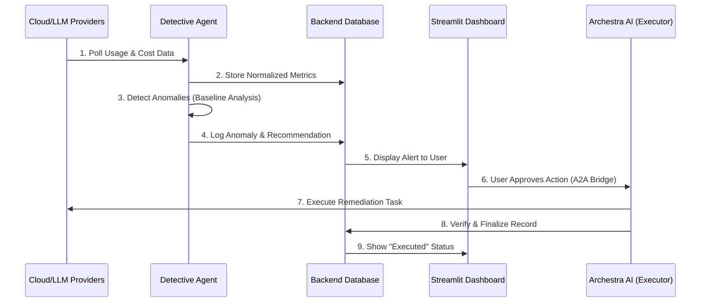

# CostGuard AI

CostGuard AI is an autonomous cloud resource and AI model cost optimization platform. It utilizes Model Context Protocol (MCP) based agents to continuously monitor cloud spending and LLM usage, identify optimization opportunities, and facilitate autonomous resource allocation adjustments.

## Project Overview

The platform deploys intelligent agents that interface with cloud provider billing APIs and LLM usage logs. These agents analyze cost data against historical baselines to detect anomalies. When an optimization opportunity or cost spike is identified, the system orchestrates a response through Archestra.AI, allowing for automated remediation with optional human-in-the-loop approval workflows.

> [!NOTE]
> Project was developed with the help of Antigravity AI tools.

## Core Workflow



## Key Features

- **Automated Anomaly Detection**: Implementation of rolling-average baseline analysis to detect significant cost deviations in real-time.
- **LLM Usage Analytics**: Granular tracking of token usage, model latency, and quality scores across multiple providers (OpenAI, Anthropic).
- **Intelligent Resource Optimization**: Automated recommendation and execution of cost-saving measures, such as switching to cost-efficient models or scaling down underutilized cloud resources.
- **Integrated Communication Bridge**: An A2A (Agent-to-Agent) communication layer that facilitates seamless interaction between the CostGuard backend and Archestra.AI orchestration agents.
- **Unified Dashboard**: A comprehensive Streamlit-based interface providing real-time visualization of cost trends, provider breakdowns, and active optimization states.

## Tech Stack

- **Backend**: Python 3.10+, FastAPI, SQLAlchemy
- **Frontend**: Streamlit
- **Protocols**: Model Context Protocol (MCP), JSON-RPC 2.0
- **Database**: PostgreSQL / SQLite
- **Orchestration**: Archestra.AI
- **Infrastructure**: Docker, Docker Compose

## Getting Started

### Prerequisites

- Docker and Docker Compose
- Python 3.10 or higher
- API keys for OpenAI, Anthropic, or Archestra.AI (configured in `.env`)

### Local Setup

1. **Clone & Setup**:
   ```bash
   cp .env.example .env
   # Populate your API keys in .env
   ```

2. **Launch Services**:
   ```bash
   docker-compose up --build
   ```

3. **Access Interfaces**:
   - **Dashboard**: `http://localhost:8501`
   - **API Docs**: `http://localhost:8000/docs`

## API Documentation

The backend service provides interactive OpenAPI (Swagger) documentation available at the `/docs` endpoint, featuring detailed schema definitions and request/response examples for all monitoring and orchestration endpoints.
