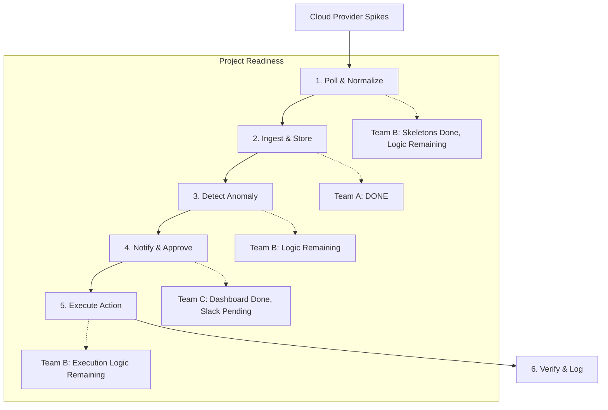

# CostGuard AI — Simple Workflow & Status

CostGuard AI automatically detects cloud cost spikes and suggests optimization actions. 

## End-to-End Workflow

## Step-by-Step Breakdown

### 1. Data Collection (Team B)
- **Status**: 🟡 **In Progress**
- **What it does**: Polls AWS/GCP/Azure APIs for cost data and converts it to a standard format.
- **Done**: MCP server structures and skeletons for all 3 providers.
- **Remaining**: Implementation of actual API calls to Cloud Billing services.

### 2. Ingestion & Storage (Team A)
- **Status**: 🟢 **DONE**
- **What it does**: Receives data from agents and saves it to the Postgres database.
- **Done**: All API endpoints, database schemas, and automatic migrations.

### 3. Anomaly Detection (Team B)
- **Status**: 🟡 **In Progress**
- **What it does**: "Detective" agent compares costs to historical averages to find spikes.
- **Done**: Data models can store and retrieve anomalies.
- **Remaining**: Logic for the background worker to trigger scans.

### 4. Approval & UI (Team C)
- **Status**: 🟢 **DONE** (Mostly)
- **What it does**: Dashboard shows anomalies; users can click "Approve" to fix issues.
- **Done**: Dashboard connectivity, "Anomalies" list, "Actions" approval UI.
- **Remaining**: Slack notifications integration.

### 5. Execution & Verification (Team A/B)
- **Status**: 🔴 **Remaining**
- **What it does**: Once approved, the "Executor" agent applies the fix (e.g., resizing an instance).
- **Remaining**: Integration between the "Approve" button and actual cloud provider write-actions.

---

## Simple Try-It-Out

1. **Start Stack**: `docker-compose up --build`
2. **Setup Data**: Click **"FIX: Re-Seed Database"** in the UI sidebar.
3. **Verify**: View anomalies at `http://localhost:8501`.
4. **Test API**: Add your own data at `http://localhost:8000/docs`.
