# CostGuard AI — Workflow Flowchart

**Hypothetical Scenario:** Weekend spike in cloud query costs — BigQuery job runs repeatedly, causing billing anomaly

## End-to-End Flow with Team Ownership

```mermaid
flowchart TD
    Start([Saturday 2 AM: BigQuery job loops]) --> Poll
    
    subgraph TeamB [Team B - Provider Integrations]
        Poll[GCP Billing Adapter polls BigQuery export] --> Normalize[Normalize cost data to standard format]
        Normalize --> Send[Send normalized summary to backend]
    end
    
    subgraph TeamA1 [Team A - Backend]
        Send --> Ingest[Backend API ingests cost snapshot]
        Ingest --> Store1[(Store in Database)]
    end
    
    subgraph TeamB2 [Team B - Agent Logic]
        Store1 --> Trigger[Archestra triggers Detective agent]
        Trigger --> Analyze[Detective compares current vs historical]
        Analyze --> Anomaly{Anomaly detected?}
        Anomaly -->|Yes| CreateAnomaly[Create anomaly record with severity HIGH]
        Anomaly -->|No| End1([Normal operation - no action])
        CreateAnomaly --> ProposeAction[Optimizer suggests: pause BigQuery job]
    end
    
    subgraph Archestra [Archestra.AI - Orchestration]
        ProposeAction --> WorkflowStart[Start approval workflow]
        WorkflowStart --> Safety[Check safety rules & budget caps]
        Safety --> Route[Route to approval queue]
    end
    
    subgraph TeamA2 [Team A - Backend]
        Route --> PersistAction[Store optimization action in DB]
        PersistAction --> SetStatus[Set status: pending_approval]
    end
    
    subgraph TeamC1 [Team C - UI & Notifications]
        SetStatus --> Notify[Send Slack notification]
        Notify --> UIUpdate[UI dashboard shows anomaly banner]
        UIUpdate --> Operator[Operator views anomaly details in Streamlit]
    end
    
    Operator --> Decision{Approve or Reject?}
    
    subgraph TeamC2 [Team C - UI]
        Decision -->|Approve| ApproveUI[Operator clicks Approve button]
        Decision -->|Reject| RejectUI[Operator clicks Reject]
    end
    
    subgraph TeamA3 [Team A - Backend]
        ApproveUI --> RecordApproval[Backend records approval + approver ID]
        RecordApproval --> NotifyArchestra[Notify Archestra to continue]
        RejectUI --> RecordReject[Backend records rejection]
        RecordReject --> End2([Workflow stopped - no action taken])
    end
    
    subgraph Archestra2 [Archestra.AI - Orchestration]
        NotifyArchestra --> TriggerExecutor[Trigger Executor agent with approved action]
    end
    
    subgraph TeamB3 [Team B - Agent Logic]
        TriggerExecutor --> ExecuteAction[Executor calls cloud-resource-server]
        ExecuteAction --> CloudAPI[Call GCP API to pause BigQuery job]
        CloudAPI --> Verify[Verify job status changed]
        Verify --> ReportResult[Report success/failure back]
    end
    
    subgraph TeamA4 [Team A - Backend]
        ReportResult --> UpdateStatus[Update action status: executed]
        UpdateStatus --> AuditLog[Write audit log with timestamps, image SHA, result]
        AuditLog --> Metrics[Emit Prometheus metrics]
    end
    
    subgraph TeamC3 [Team C - UI & Monitoring]
        Metrics --> Grafana[Grafana shows cost recovery graph]
        Grafana --> UIRefresh[UI updates action status to 'Resolved']
        UIRefresh --> SlackConfirm[Send success notification to Slack]
    end
    
    SlackConfirm --> End3([Anomaly resolved - costs normalized])
    
    subgraph TeamC_CI [Team C - CI/CD]
        CI_Build[GitHub Actions builds Docker images] --> CI_Tag[Tag images with git SHA]
        CI_Tag --> CI_Push[Push to container registry]
        CI_Push --> Archestra_Pull[Archestra pulls exact image for execution]
    end
    
    CI_Build -.->|Provides immutable images| TriggerExecutor
    
    style TeamB fill:#e1f5ff
    style TeamB2 fill:#e1f5ff
    style TeamB3 fill:#e1f5ff
    style TeamA1 fill:#ffe1e1
    style TeamA2 fill:#ffe1e1
    style TeamA3 fill:#ffe1e1
    style TeamA4 fill:#ffe1e1
    style TeamC1 fill:#e1ffe1
    style TeamC2 fill:#e1ffe1
    style TeamC3 fill:#e1ffe1
    style TeamC_CI fill:#e1ffe1
    style Archestra fill:#fff4e1
    style Archestra2 fill:#fff4e1
```



## Team Responsibilities Summary

### Team A (Backend & Persistence) — Red boxes
- Ingest cost snapshots and LLM usage via API endpoints
- Store anomalies, optimization actions, approvals in database
- Record audit logs with workflow metadata (image SHA, timestamps, approver)
- Emit metrics to Prometheus
- Provide REST endpoints for UI and agent reads/writes

### Team B (Provider Integrations & Agent Logic) — Blue boxes
- Poll cloud billing APIs (AWS/GCP/Azure)
- Normalize cost data to standard format
- Implement `detective` agent (anomaly detection logic)
- Implement `executor` agent (cloud action execution via APIs)
- Call MCP server adapters for provider-specific operations

### Team C (UI, CI/CD & Dockerization) — Green boxes
- Build Streamlit dashboard showing anomalies and actions
- Implement approval controls (Approve/Reject UI)
- Send Slack notifications
- Integrate Grafana dashboards for cost recovery visualization
- Build Docker images in CI and push to registry (tagged by git SHA)
- Provide deployment scripts and compose orchestration

### Archestra.AI (External Orchestration) — Yellow boxes
- Schedule and trigger agent workflows
- Enforce safety rules and budget caps
- Manage approval workflow states
- Pull exact Docker images (by SHA) for reproducible execution
- Capture agent outputs and route to next step

## Key Integration Points

1. **Team B → Team A**: Agents write anomalies/actions to backend API
2. **Team A → Team C**: Backend exposes data via REST; UI fetches and displays
3. **Team C → Team A**: UI approval actions POST to backend endpoints
4. **Team A → Archestra**: Backend notifies Archestra to continue workflows
5. **Archestra → Team B**: Archestra triggers agents using CI-built images (Team C provides)
6. **Team C CI → Archestra**: CI pushes images; Archestra pulls exact versions

## Why Docker Images Matter in This Flow

- **Immutability**: When executor runs, we know exactly which code version executed (recorded in audit log)
- **Reproducibility**: Same image runs in dev, staging, and production
- **Safety**: Archestra can enforce "only approved image SHAs can execute actions"
- **Rollback**: If an image causes issues, revert to previous SHA
- **Isolation**: Each service (backend, UI, adapters, agents) runs in its own container with defined resources

## Try It Locally

```bash
# Start the full stack (after Team A implements backend)
docker compose up --build

# Simulate anomaly detection
curl -X POST http://localhost:8000/api/v1/anomalies \
  -H "Content-Type: application/json" \
  -d '{"severity":"high","description":"BigQuery spike"}'

# View in UI
open http://localhost:8501
```
